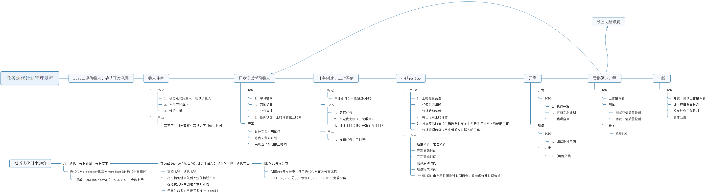
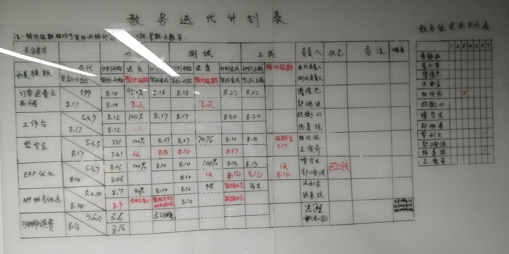

---
## 一、团队状态反馈
上周组织了一个团队会议（参与人包括所有教务组开发人员、测试人员、产品和运营）就教务迭代启动规划管理流程进行了约定,经过一周的试运行感觉挺好的,小伙伴们都能够比较清晰的知道项目管理的每个阶段需要开展的工作。流程如下（confluence地址：http://doc.klxuexi.org/pages/viewpage.action?pageId=16820522）：

为了使工作更加透明，降低沟通成本，我们通过白板维护迭代的每日状态，小伙伴们自行更新每日迭代状态，开发，测试，运营，产品对团队的整个状态一目了然

----

## 二、去Oracle反思

本周主要在思考oracle转mysql的解决方案和技术可行性。和军力沟通了一下，发现自己想的深度确实不够，也不够长远，比如以后的分库分表要怎么去实现，现有的报表架构还能走多远，眼界局限在了去oracle。

反思和改进：
    需要更深入的去思考ERP的互联网架构要如何做，如何使ERP能够适用分库分表，高并发，高可用。
    思考并调研现有的报表体系如何进行重构，探索实时报表架构解决方案（正在对大数据方案进行调研）

---

## 三、ERP线上问题反复出现反思

最近发现教务系统经常会因为上线某个功能，又影响到了其它的功能。由于教务系统的业务比较复杂。小伙伴开发或测试的时候往往很多细小的影响点是覆盖不到的。

反思和改进：
    推教务系统的接口自动化测试，项目上线要求提供自动化测试覆盖率。目前一站通是有在做一部分的接口自动化，但是我并没有提出我的要求程度。所以后续我们会建立自己的测试流程。目前ERP做接口自动化还是比较困难的，接口定义和返回参数中包含了大量的干扰信息，自动化脚本编写困难。随着业务的不对优化，我们会不断的优化ERP的接口。