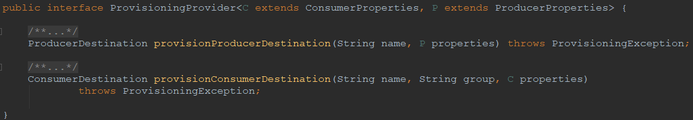
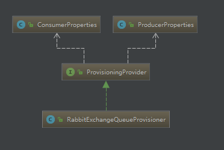

### 领域概念

1. 生产者和消费者提供商：ProvisioningProvider
    > * 作用：根据提供的生产者和消费者属性创建生产者目标和消费者目标
    > * 源码：
    > * 结构：
2. 消息目标 
    > * ProducerDestination（实体），封装了将要创建的RabbitMq#Exchange信息
    > * ConsumerDestination（实体），封装了将要创建的RabbitMq#Exchange信息

### 启动规则
EnableAutoConfiguration:

  >1. org.springframework.cloud.stream.config.ChannelBindingAutoConfiguration
  >2. org.springframework.cloud.stream.config.BindersHealthIndicatorAutoConfiguration
  >3. org.springframework.cloud.stream.config.ChannelsEndpointAutoConfiguration
  >4. org.springframework.cloud.stream.config.BindingsEndpointAutoConfiguration

### 核心流程

