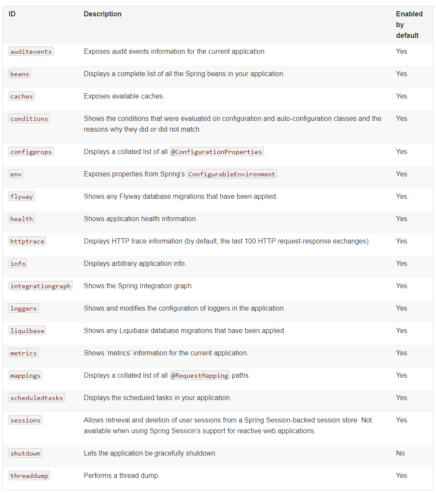

官方文档：https://docs.spring.io/spring-boot/docs/2.1.7.RELEASE/reference/html/

作用：监控Spring运行时环境，手机运行时的各项指标（内存，cup，线程等）


## 一、启用actuator

```xml
<dependencies>
	<dependency>
		<groupId>org.springframework.boot</groupId>
		<artifactId>spring-boot-starter-actuator</artifactId>
	</dependency>
</dependencies>
```

## 二、Endpoints

Endpoints时什么：我们可以通过Endpoint从application获取标信息，或者对application发送指令，其实Endpoint和我们的controller的功能时类似的（为客户端提供服务）

约定：
* Endpoints通过Http或者JMX暴露给远程客户端访问
* 所有的Endpoints的访问路径默认为`/actuator/endpoint_id`


系统已经实现的Endpoints



Web 应用程序(Spring MVC, Spring WebFlux, or Jersey)还支持以下Endpoints


### 2.1 Enabling Endpoints

除了`shutdown`其它的endpoint默认都是激活的，我们使用`management.endpoint.<id>.enabled`激活一个endpoint,示例：
```properties
management.endpoint.shutdown.enabled=true
```
通过`management.endpoints.enabled-by-default=false`禁止默认启用endpoints的行为,然后再通过`management.endpoint.info.enabled=true`逐个启用endpoint

### 2.2 Exposing Endpoints

Endpoints包含了一些敏感信息，我们要考虑是否向往暴露接口，我们看下系统对内建Endpoint的默认行为


我们可以通过`include `和`exclude `属性来自定义暴露哪些Endpoint。先看下系统的默认配置


`exclude `的优先级会高于`include `。
看几个例子：

	示例1:jmx仅暴露health,info
	`management.endpoints.jmx.exposure.include=health,info`

	示例2：web应用中除了env和beans 其它的全部暴露 （通过http://server/actuator/id访问）
	```properties
		management.endpoints.web.exposure.include=*
		management.endpoints.web.exposure.exclude=env,beans
	```
如果我们想自定义expose 策略，可以注册自定义EndpointFilter对象。

### 2.3 和Spring Security配合使用 `EndpointRequest`

```java
@Configuration
public class ActuatorSecurity extends WebSecurityConfigurerAdapter {

	@Override
	protected void configure(HttpSecurity http) throws Exception {
		http.requestMatcher(EndpointRequest.toAnyEndpoint()).authorizeRequests()
				.anyRequest().hasRole("ENDPOINT_ADMIN")
				.and()
			.httpBasic();
	}

}
```
需要"ENDPOINT_ADMIN"角色才能访问到actuator endpoint,再看看如何完全放开对endpoint的访问

```java
@Configuration
public class ActuatorSecurity extends WebSecurityConfigurerAdapter {

	@Override
	protected void configure(HttpSecurity http) throws Exception {
		http.requestMatcher(EndpointRequest.toAnyEndpoint()).authorizeRequests()
			.anyRequest().permitAll();
	}

}
```

### 2.4 Configuring Endpoints

如果endpoint端口是不需要任何参数的，那么响应信息会被缓存。我们可以配置缓存失效时间通过`cache.time-to-live`属性，示例：
```properties
management.endpoint.beans.cache.time-to-live=10s
```
约定：
	1. 前缀： management.endpoint.<name> 
	2. 如果使用了 Spring Security 则 `Principal` 会被认为是endpoint的入参，这样的化Response信息也就不会被保存

### 2.5 management context path

我们可以为Endpoints启用一个新的tomcat容器（必须要指定一个和Server不一样的端口，否则配置不会生效），示例
```yml

server:
  port: 8081 #@1
management:
  endpoints:
    web:
      exposure:
        include: "*"
  server:
    servlet:
      context-path: /bbb #@2
    port: 8089 #@3
```
@3处的端口号不能和@1处相同，如果相同 management.server配置不会生效。现在我们可以通过 `http://localhost:8089/bbb/actuator/info`访问info信息

### 2.6 跨域访问支持

默认是禁用的，通过以下配置启用
```properties
management.endpoints.web.cors.allowed-origins=https://example.com
management.endpoints.web.cors.allowed-methods=GET,POST
```

### 2.6 Implementing Custom Endpoints

// TODO 