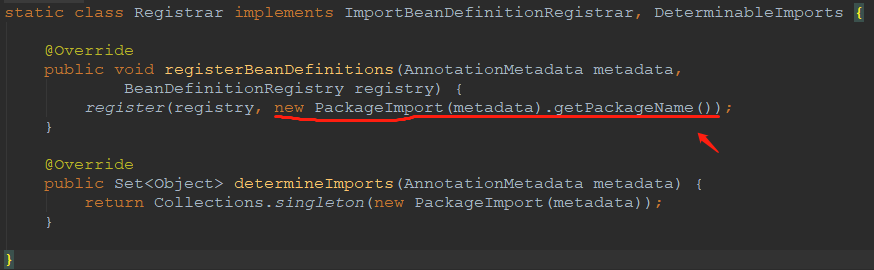

自动配置系统流程

@EnableAutoConfiguration

  * @AutoConfigurationPackage
      
      1. @Import(AutoConfigurationPackages.Registrar.class)
         
  
  * @Import(AutoConfigurationImportSelector.java) 

### 领域概念

元数据 AutoConfigurationMetadata
元数据加载器 AutoConfigurationMetadataLoader
