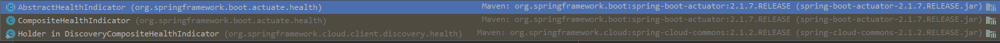
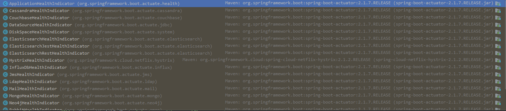

参考文档：
https://www.docs4dev.com/docs/zh/spring-cloud/Finchley.SR2/reference/multi__spring_cloud_commons_common_abstractions.html

关键的几个类有 `Health，HealthAggregator，Status，HealthIndicator，InstanceInfoReplicator，DiscoveryClient`。先看下健康信息相关的`Health`类吧，它将某个组件的健康相关信息存放在Map中，并为组件提供了整体状态值`Status`。我们看下源码

```java
public final class Health {

	private final Status status;

	private final Map<String, Object> details;

    // ...
}

public final class Status {

	public static final Status UNKNOWN = new Status("UNKNOWN");

	public static final Status UP = new Status("UP");

	public static final Status DOWN = new Status("DOWN");

	public static final Status OUT_OF_SERVICE = new Status("OUT_OF_SERVICE");

	private final String code;

	private final String description;

	public Status(String code) {
		this(code, "");
	}

	public Status(String code, String description) {
		Assert.notNull(code, "Code must not be null");
		Assert.notNull(description, "Description must not be null");
		this.code = code;
		this.description = description;
	}
}
```
健康状态的模型已经有了，那么每一个组件要向外部发布自己的健康状况呢，就是通过`HealthIndictor`健康状况指示器

```java
public interface HealthIndicator {

	/**
	 * Return an indication of health.（返回组件的健康相关信息）
	 * @return the health for
	 */
	Health health();

}
```
`HealthIndicator`接口在此处应用的是策略者模式，比如：邮件有自己的监控标准，rabbitmq也有自己的标准，每个组件的监控评判标准都是不一样的，我们看下有多少组件实现了该接口



我们先看下`AbstractHealthIndicator`做了什么
```java

public abstract class AbstractHealthIndicator implements HealthIndicator {
    // ...
	@Override
	public final Health health() {
		Health.Builder builder = new Health.Builder();
		try {
			doHealthCheck(builder);
		}
		catch (Exception ex) {
			if (this.logger.isWarnEnabled()) {
				String message = this.healthCheckFailedMessage.apply(ex);
				this.logger.warn(StringUtils.hasText(message) ? message : DEFAULT_MESSAGE, ex);
			}
			builder.down(ex);
		}
		return builder.build();
	}

	/**
	 * Actual health check logic.
	 * @param builder the {@link Builder} to report health status and details
	 * @throws Exception any {@link Exception} that should create a {@link Status#DOWN}
	 * system status.
	 */
	protected abstract void doHealthCheck(Health.Builder builder) throws Exception;
}

```
我们看到`health()`里面把构建Health对象的逻辑又封装了一层，当构建Health对象抛出异常的时候，将返回`DOWN`状态。看下`AbstractHealthIndicator`的子类有哪些



好了，我们再看看`CompositeHealthIndicator`，它是不是就是把很多的`AbstractHealthIndicator`对象组合在一块统一返回一个Health对象呢，我们看看源码
```java

public class CompositeHealthIndicator implements HealthIndicator {

	private final HealthIndicatorRegistry registry; // 一个用来存放 HealthIndicator 对象的数组

	private final HealthAggregator aggregator; // 将多个health聚合在一起
    // ...
	@Override
	public Health health() {
		Map<String, Health> healths = new LinkedHashMap<>();
		for (Map.Entry<String, HealthIndicator> entry : this.registry.getAll().entrySet()) {
			healths.put(entry.getKey(), entry.getValue().health());
		}
		return this.aggregator.aggregate(healths);
	}
    // ...

}
```
上面源码描述了：会调用HealthIndicatorRegistry中所有`HealthIndicator.health()`方法，将收集到的Health对象进行聚合。聚合调用：`this.aggregator.aggregate(healths)`，我们看下它做了什么

```java
// 为什么要就`HealthAggregator`呢，试想一下：我们的服务中包含 'email','rabbitmq','zipkin'等等，每个组件都有自己的Health信息和Status，但是我们的服务对外能只能存在一个统一的Health信息和唯一的Status，那么我们就需要制定我们自己的算法，将所有组件的Health聚合成一个。
public interface HealthAggregator {

	Health aggregate(Map<String, Health> healths);
}


public abstract class AbstractHealthAggregator implements HealthAggregator {

	@Override
	public final Health aggregate(Map<String, Health> healths) {
		List<Status> statusCandidates = healths.values().stream().map(Health::getStatus).collect(Collectors.toList());
        // invoke 1
		Status status = aggregateStatus(statusCandidates);
        // invoke 2
		Map<String, Object> details = aggregateDetails(healths);
		return new Health.Builder(status, details).build();
	}
    // @1 这里需要封装聚合Health对象的获取status的算法
	protected abstract Status aggregateStatus(List<Status> candidates);
    // @2 就是把healths对象清单放到Health对象的detail中
	protected Map<String, Object> aggregateDetails(Map<String, Health> healths) {
		return new LinkedHashMap<>(healths);
	}
}

public class OrderedHealthAggregator extends AbstractHealthAggregator {

	private List<String> statusOrder;

	public OrderedHealthAggregator() {
		setStatusOrder(Status.DOWN, Status.OUT_OF_SERVICE, Status.UP, Status.UNKNOWN);
	}

	@Override
	protected Status aggregateStatus(List<Status> candidates) {
		// Only sort those status instances that we know about
		List<Status> filteredCandidates = new ArrayList<>();
		for (Status candidate : candidates) {
			if (this.statusOrder.contains(candidate.getCode())) {
				filteredCandidates.add(candidate);
			}
		}
		// If no status is given return UNKNOWN
		if (filteredCandidates.isEmpty()) {
			return Status.UNKNOWN;
		}
		// Sort given Status instances by configured order
		filteredCandidates.sort(new StatusComparator(this.statusOrder));
        // 返回第一个Status（最坏的状态）
		return filteredCandidates.get(0);
	}

	private class StatusComparator implements Comparator<Status> {

		// ...
		@Override
		public int compare(Status s1, Status s2) {
			int i1 = this.statusOrder.indexOf(s1.getCode()); // 按照索引位置排序
			int i2 = this.statusOrder.indexOf(s2.getCode());
			return (i1 < i2) ? -1 : (i1 != i2) ? 1 : s1.getCode().compareTo(s2.getCode());
		}

	}

}
```
通过源码我们发现，最终创建的是 `OrderedHealthAggregator`对象，它会将所有的healths对象填充到聚合OrderedHealthAggregator对象中的details中，将Status按照 `Status.DOWN, Status.OUT_OF_SERVICE, Status.UP, Status.UNKNOWN`进行排序，并返回列表第一个值。

到目前为止，我们描述了两种呈现Health的场景，一种场景是单个组件的Health，另一种是将多个组件组合在一起的Health。我们看下Health是如何聚合在一起的

```java
public interface HealthIndicatorRegistry {

	void register(String name, HealthIndicator healthIndicator);

	HealthIndicator unregister(String name);

	HealthIndicator get(String name);

	Map<String, HealthIndicator> getAll();

}

public class DefaultHealthIndicatorRegistry implements HealthIndicatorRegistry {

	private final Object monitor = new Object();

	private final Map<String, HealthIndicator> healthIndicators;

	public DefaultHealthIndicatorRegistry() {
		this(new LinkedHashMap<>());
	}

	public DefaultHealthIndicatorRegistry(Map<String, HealthIndicator> healthIndicators) {
		Assert.notNull(healthIndicators, "HealthIndicators must not be null");
		this.healthIndicators = new LinkedHashMap<>(healthIndicators);
	}

	@Override
	public void register(String name, HealthIndicator healthIndicator) {
		Assert.notNull(healthIndicator, "HealthIndicator must not be null");
		Assert.notNull(name, "Name must not be null");
		synchronized (this.monitor) {
			HealthIndicator existing = this.healthIndicators.putIfAbsent(name, healthIndicator);
			if (existing != null) {
				throw new IllegalStateException("HealthIndicator with name '" + name + "' already registered");
			}
		}
	}

	@Override
	public HealthIndicator unregister(String name) {
		Assert.notNull(name, "Name must not be null");
		synchronized (this.monitor) {
			return this.healthIndicators.remove(name);
		}
	}

	@Override
	public HealthIndicator get(String name) {
		Assert.notNull(name, "Name must not be null");
		synchronized (this.monitor) {
			return this.healthIndicators.get(name);
		}
	}

	@Override
	public Map<String, HealthIndicator> getAll() {
		synchronized (this.monitor) {
			return Collections.unmodifiableMap(new LinkedHashMap<>(this.healthIndicators));
		}
	}

}
```

那么`HealthIndicator`又是如何实例化的呢

```java
public abstract class CompositeHealthIndicatorConfiguration<H extends HealthIndicator, S> {

	@Autowired
	private HealthAggregator healthAggregator;

	protected HealthIndicator createHealthIndicator(Map<String, S> beans) {
		if (beans.size() == 1) {
			return createHealthIndicator(beans.values().iterator().next());
		}
        // @1 DefaultHealthIndicatorRegistry 是个工具类
		HealthIndicatorRegistry registry = new DefaultHealthIndicatorRegistry();
		beans.forEach((name, source) -> registry.register(name, createHealthIndicator(source)));
		return new CompositeHealthIndicator(this.healthAggregator, registry);
	}

	@SuppressWarnings("unchecked")
	protected H createHealthIndicator(S source) {
		Class<?>[] generics = ResolvableType.forClass(CompositeHealthIndicatorConfiguration.class, getClass())
				.resolveGenerics();
		Class<H> indicatorClass = (Class<H>) generics[0];
		Class<S> sourceClass = (Class<S>) generics[1];
		try {
			return indicatorClass.getConstructor(sourceClass).newInstance(source);
		}
		catch (Exception ex) {
			throw new IllegalStateException(
					"Unable to create indicator " + indicatorClass + " for source " + sourceClass, ex);
		}
	}

}

//CompositeHealthIndicatorConfiguration子类中的一个
@Configuration
@ConditionalOnClass(JavaMailSenderImpl.class)
@ConditionalOnBean(JavaMailSenderImpl.class)
@ConditionalOnEnabledHealthIndicator("mail")
@AutoConfigureBefore(HealthIndicatorAutoConfiguration.class)
@AutoConfigureAfter(MailSenderAutoConfiguration.class)
public class MailHealthIndicatorAutoConfiguration
		extends CompositeHealthIndicatorConfiguration<MailHealthIndicator, JavaMailSenderImpl> {

	private final Map<String, JavaMailSenderImpl> mailSenders;

	public MailHealthIndicatorAutoConfiguration(Map<String, JavaMailSenderImpl> mailSenders) {
		this.mailSenders = mailSenders;
	}

	@Bean
	@ConditionalOnMissingBean(name = "mailHealthIndicator")
	public HealthIndicator mailHealthIndicator() {

        // @1 创建 
		return createHealthIndicator(this.mailSenders);
	}

}
```
可以发现，`mailHealthIndicator()`调用的是抽象父类的方法。到此，我们已经解读完了 HealthIndicator 的创建过程。


我们回过头来分析下启用`eureka.client.healthcheck.enabled`后会有什么效果

```java
@Configuration
@EnableConfigurationProperties
@ConditionalOnClass(EurekaClientConfig.class)
@ConditionalOnProperty(value = "eureka.client.enabled", matchIfMissing = true)
@ConditionalOnDiscoveryEnabled
public class EurekaDiscoveryClientConfiguration {
    // ...
	@Configuration
	@ConditionalOnProperty(value = "eureka.client.healthcheck.enabled", matchIfMissing = false)
	protected static class EurekaHealthCheckHandlerConfiguration {

		@Autowired(required = false)
		private HealthAggregator healthAggregator = new OrderedHealthAggregator();

		@Bean
		@ConditionalOnMissingBean(HealthCheckHandler.class)
		public EurekaHealthCheckHandler eurekaHealthCheckHandler() {
			return new EurekaHealthCheckHandler(this.healthAggregator);
		}
	}
    // ...
}
```
这里创建了`EurekaHealthCheckHandler`对象，那么它做了什么呢？我们发现，`afterPropertiesSet() `会将所有的healthIndicator都填充到`CompositeHealthIndicator`中

```java
public class EurekaHealthCheckHandler implements HealthCheckHandler, ApplicationContextAware, InitializingBean {

    private final CompositeHealthIndicator healthIndicator;
    // ...
	@Override
	public void afterPropertiesSet() throws Exception {
        // 获取所有的 HealthIndicator 对象
		final Map<String, HealthIndicator> healthIndicators = applicationContext.getBeansOfType(HealthIndicator.class);

		for (Map.Entry<String, HealthIndicator> entry : healthIndicators.entrySet()) {

			// ignore EurekaHealthIndicator and flatten the rest of the composite
			// otherwise there is a never ending cycle of down. See gh-643
			if (entry.getValue() instanceof DiscoveryCompositeHealthIndicator) {
				DiscoveryCompositeHealthIndicator indicator = (DiscoveryCompositeHealthIndicator) entry.getValue();
				for (DiscoveryCompositeHealthIndicator.Holder holder : indicator.getHealthIndicators()) {
					if (!(holder.getDelegate() instanceof EurekaHealthIndicator)) {
						healthIndicator.addHealthIndicator(holder.getDelegate().getName(),holder);
					}
				}

			} else {
				healthIndicator.addHealthIndicator(entry.getKey(), entry.getValue());
			}
		}
	}
    // ...

	@Override
	public InstanceStatus getStatus(InstanceStatus instanceStatus) {
		return getHealthStatus();
	}

	protected InstanceStatus getHealthStatus() {
		final Status status = getHealthIndicator().health().getStatus();
		return mapToInstanceStatus(status);
	}
    @Override
	public InstanceStatus getStatus(InstanceStatus instanceStatus) {
		return getHealthStatus();
	}

	protected InstanceStatus getHealthStatus() {
		final Status status = getHealthIndicator().health().getStatus();
		return mapToInstanceStatus(status);
	}

	protected InstanceStatus mapToInstanceStatus(Status status) {
		if (!STATUS_MAPPING.containsKey(status)) {
			return InstanceStatus.UNKNOWN;
		}
		return STATUS_MAPPING.get(status);
	}
}
```
通过分析发现`EurekaHealthCheckHandler`的核心目的就是返回实例状态。那么是在哪个地方调用的`getStatus()`呢

```java
public class DiscoveryClient implements EurekaClient {
    // ...
    void refreshInstanceInfo() {
        applicationInfoManager.refreshDataCenterInfoIfRequired();
        applicationInfoManager.refreshLeaseInfoIfRequired();

        InstanceStatus status;
        try {
            // @1
            status = getHealthCheckHandler().getStatus(instanceInfo.getStatus());
        } catch (Exception e) {
            logger.warn("Exception from healthcheckHandler.getStatus, setting status to DOWN", e);
            status = InstanceStatus.DOWN;
        }

        if (null != status) {
            applicationInfoManager.setInstanceStatus(status);
        }
    }
    // ...    
}

public class ApplicationInfoManager {
    // ...
    public synchronized void setInstanceStatus(InstanceStatus status) {
        InstanceStatus next = instanceStatusMapper.map(status);
        if (next == null) {
            return;
        }

        InstanceStatus prev = instanceInfo.setStatus(next);
        if (prev != null) {
            // 发布事件
            for (StatusChangeListener listener : listeners.values()) {
                try {
                    listener.notify(new StatusChangeEvent(prev, next));
                } catch (Exception e) {
                    logger.warn("failed to notify listener: {}", listener.getId(), e);
                }
            }
        }
    }
    // ...
}
```

我们发现在`refreshInstanceInfo() `才会调用到更新状态，那么哪个地方调用它呢


```java
class InstanceInfoReplicator implements Runnable{
    // ...

    public void run() { 
        try {
            // @1
            discoveryClient.refreshInstanceInfo();

            Long dirtyTimestamp = instanceInfo.isDirtyWithTime();
            if (dirtyTimestamp != null) {
                discoveryClient.register(); // 调用远程服务器接口，进行注册
                instanceInfo.unsetIsDirty(dirtyTimestamp);
            }
        } catch (Throwable t) {
            logger.warn("There was a problem with the instance info replicator", t);
        } finally {
            // 启用定时任务
            Future next = scheduler.schedule(this, replicationIntervalSeconds, TimeUnit.SECONDS);
            scheduledPeriodicRef.set(next);
        }
    }
    // ...
}
```

我们发现`InstanceInfoReplicator.run()`就是EurekaClient真正向Eureka Server注册的地方，那么在哪些地方会触发EurekaClient向Eureka Server注册instanceInfo呢？如下：

```java

class InstanceInfoReplicator implements Runnable{
    // ...
    public boolean onDemandUpdate() {
        if (rateLimiter.acquire(burstSize, allowedRatePerMinute)) {
            if (!scheduler.isShutdown()) {
                scheduler.submit(new Runnable() {
                    @Override
                    public void run() {
                        logger.debug("Executing on-demand update of local InstanceInfo");
    
                        Future latestPeriodic = scheduledPeriodicRef.get();
                        // 如果上一个注册调度任务没有执行，则关闭
                        if (latestPeriodic != null && !latestPeriodic.isDone()) {
                            logger.debug("Canceling the latest scheduled update, it will be rescheduled at the end of on demand update");
                            latestPeriodic.cancel(false);
                        }
                        // 运行注册逻辑，并构建下一次注册调度任务
                        InstanceInfoReplicator.this.run();
                    }
                });
                return true;
            } else {
                logger.warn("Ignoring onDemand update due to stopped scheduler");
                return false;
            }
        } else {
            logger.warn("Ignoring onDemand update due to rate limiter");
            return false;
        }
    }
    
    public void start(int initialDelayMs) {
        if (started.compareAndSet(false, true)) {
            instanceInfo.setIsDirty();  // for initial register
            // 构建注册调度任务（执行this.run()）
            Future next = scheduler.schedule(this, initialDelayMs, TimeUnit.SECONDS);
            scheduledPeriodicRef.set(next);
        }
    }

    // ...
}
```
onDemandUpdate 和 start 又是怎么触发的？我们看看

```java

public class DiscoveryClient implements EurekaClient {
    // ...
    // 场景一、注册 HealthCheckHandler 时
    @Override
    public void registerHealthCheck(HealthCheckHandler healthCheckHandler) {
        if (instanceInfo == null) {
            logger.error("Cannot register a healthcheck handler when instance info is null!");
        }
        if (healthCheckHandler != null) {
            this.healthCheckHandlerRef.set(healthCheckHandler);
            // schedule an onDemand update of the instanceInfo when a new healthcheck handler is registered
            if (instanceInfoReplicator != null) {
                // @1
                instanceInfoReplicator.onDemandUpdate();
            }
        }
    }
    // ...
    /**
     * Initializes all scheduled tasks.
     */
    private void initScheduledTasks() {
        // ...
        if (clientConfig.shouldRegisterWithEureka()) {
            int renewalIntervalInSecs = instanceInfo.getLeaseInfo().getRenewalIntervalInSecs();
            int expBackOffBound = clientConfig.getHeartbeatExecutorExponentialBackOffBound();
            logger.info("Starting heartbeat executor: " + "renew interval is: {}", renewalIntervalInSecs);

            // Heartbeat timer
            scheduler.schedule(
                    new TimedSupervisorTask(
                            "heartbeat",
                            scheduler,
                            heartbeatExecutor,
                            renewalIntervalInSecs,
                            TimeUnit.SECONDS,
                            expBackOffBound,
                            new HeartbeatThread()
                    ),
                    renewalIntervalInSecs, TimeUnit.SECONDS);

            // InstanceInfo replicator
            instanceInfoReplicator = new InstanceInfoReplicator(
                    this,
                    instanceInfo,
                    clientConfig.getInstanceInfoReplicationIntervalSeconds(),
                    2); // burstSize

            // 当状态发生变动的时候
            statusChangeListener = new ApplicationInfoManager.StatusChangeListener() {
                @Override
                public String getId() {
                    return "statusChangeListener";
                }

                @Override
                public void notify(StatusChangeEvent statusChangeEvent) {
                    if (InstanceStatus.DOWN == statusChangeEvent.getStatus() ||
                            InstanceStatus.DOWN == statusChangeEvent.getPreviousStatus()) {
                        // log at warn level if DOWN was involved
                        logger.warn("Saw local status change event {}", statusChangeEvent);
                    } else {
                        logger.info("Saw local status change event {}", statusChangeEvent);
                    }
                    // 场景二、当状态发生变动的时候
                    instanceInfoReplicator.onDemandUpdate();
                }
            };

            if (clientConfig.shouldOnDemandUpdateStatusChange()) {
                // 注册监听者
                applicationInfoManager.registerStatusChangeListener(statusChangeListener);
            }

            // 场景三、实例化 DiscoveryClient 的时候
            instanceInfoReplicator.start(clientConfig.getInitialInstanceInfoReplicationIntervalSeconds());
        } else {
            logger.info("Not registering with Eureka server per configuration");
        }
    }

    DiscoveryClient(ApplicationInfoManager applicationInfoManager, EurekaClientConfig config,  AbstractDiscoveryClientOptionalArgs args,  Provider<BackupRegistry> backupRegistryProvider, EndpointRandomizer endpointRandomizer) {
        // ...
        // finally, init the schedule tasks (e.g. cluster resolvers, heartbeat, instanceInfo replicator, fetch
        initScheduledTasks();
        // ...
    }
}
```

最终入口都汇聚到了`DiscoveryClient` ,共有三个场景会触发client向server注册instanceInfo。这里，我们只关注`registerHealthCheck()`。继续看源码

```java
public class EurekaClientAutoConfiguration {
    // ...
    @Configuration
	@ConditionalOnRefreshScope
	protected static class RefreshableEurekaClientConfiguration {

		@Bean(destroyMethod = "shutdown")
		@ConditionalOnMissingBean(value = EurekaClient.class, search = SearchStrategy.CURRENT)
		@org.springframework.cloud.context.config.annotation.RefreshScope
		@Lazy
		public EurekaClient eurekaClient(ApplicationInfoManager manager,EurekaClientConfig config, EurekaInstanceConfig instance, @Autowired(required = false) HealthCheckHandler healthCheckHandler) {
			ApplicationInfoManager appManager;
			if (AopUtils.isAopProxy(manager)) {
				appManager = ProxyUtils.getTargetObject(manager);
			}
			else {
				appManager = manager;
			}
			CloudEurekaClient cloudEurekaClient = new CloudEurekaClient(appManager,config, this.optionalArgs, this.context);
            // @1 创建完 CloudEurekaClient 后注册 healthCheckHandler
			cloudEurekaClient.registerHealthCheck(healthCheckHandler);
			return cloudEurekaClient;
		}
    // ...
}
// 服务注册相关的约定（注册和注销规则）
public class EurekaServiceRegistry implements ServiceRegistry<EurekaRegistration> {

    // ...
	@Override
	public void register(EurekaRegistration reg) {
        // 做一些数据初始化工作
		maybeInitializeClient(reg);

		reg.getApplicationInfoManager().setInstanceStatus(reg.getInstanceConfig().getInitialStatus());
        // 如果Spring容器中存在healthCheckHandler对象
		reg.getHealthCheckHandler().ifAvailable(healthCheckHandler -> reg .getEurekaClient().registerHealthCheck(healthCheckHandler));
	}
    // ...
	@Override
	public void deregister(EurekaRegistration reg) {
		if (reg.getApplicationInfoManager().getInfo() != null) {
			reg.getApplicationInfoManager().setInstanceStatus(InstanceInfo.InstanceStatus.DOWN);
		}
	}
    // ...
}
```
我们发现有两个地方会调用`registerHealthCheck()`，第一个是在构建EurekaClient对象时，第二个是在进行服务注册信息初始化的时候。我们看下第二个地方`register()`的调用逻辑

```java
public class EurekaAutoServiceRegistration implements AutoServiceRegistration, SmartLifecycle, Ordered, SmartApplicationListener {
	@Override
	public void start() {
		// ...
		// only initialize if nonSecurePort is greater than 0 and it isn't already running
		// because of containerPortInitializer below
		if (!this.running.get() && this.registration.getNonSecurePort() > 0) {

            // @1 初始化注册信息
			this.serviceRegistry.register(this.registration);

			this.context.publishEvent(new InstanceRegisteredEvent<>(this, this.registration.getInstanceConfig()));
			this.running.set(true);
		}
	}
    // ...
	public void onApplicationEvent(WebServerInitializedEvent event) {
		// TODO: take SSL into account
		String contextName = event.getApplicationContext().getServerNamespace();
		if (contextName == null || !contextName.equals("management")) {
			int localPort = event.getWebServer().getPort();
			if (this.port.get() == 0) {
				log.info("Updating port to " + localPort);
				this.port.compareAndSet(0, localPort);
                // 触发服务注册信息的初始化工作
				start();
			}
		}
	}
    // ...
}

@Configuration
@EnableConfigurationProperties
@ConditionalOnClass(EurekaClientConfig.class)
@ConditionalOnProperty(value = "eureka.client.enabled", matchIfMissing = true)
@ConditionalOnDiscoveryEnabled
public class EurekaDiscoveryClientConfiguration {
    @Configuration
	@ConditionalOnClass(RefreshScopeRefreshedEvent.class)
	protected static class EurekaClientConfigurationRefresher implements ApplicationListener<RefreshScopeRefreshedEvent> {

		@Autowired(required = false)
		private EurekaClient eurekaClient;

		@Autowired(required = false)
		private EurekaAutoServiceRegistration autoRegistration;
        // 刷新Scope时触发更新注册信息
		public void onApplicationEvent(RefreshScopeRefreshedEvent event) {
			// This will force the creation of the EurkaClient bean if not already created
			// to make sure the client will be reregistered after a refresh event
			if (eurekaClient != null) {
				eurekaClient.getApplications();
			}
			if (autoRegistration != null) {
				// register in case meta data changed
				this.autoRegistration.stop();
				this.autoRegistration.start();
			}
		}

	}
}

```

我们可以发现，Eureka Client的本地注册信息初始化是事件驱动的，在WebServerInitializedEvent 和 RefreshScopeRefreshedEvent 会调用`serviceRegistry.register`来初始化本地注册信息，并将 healthCheckHandler 设置到EurekaClient对象中（status 就是 healthCheckHandler 返回的）。到目前为止，我们还是没有看到在哪个地方设置的Status，再看看源码

```java
public class DiscoveryClient implements EurekaClient {
    // ...
    void refreshInstanceInfo() {
        // 检测相关配置信息是否发生变化，如果有变化，需要刷新
        applicationInfoManager.refreshDataCenterInfoIfRequired();
        applicationInfoManager.refreshLeaseInfoIfRequired();

        InstanceStatus status;
        try {
            status = getHealthCheckHandler().getStatus(instanceInfo.getStatus());
        } catch (Exception e) {
            logger.warn("Exception from healthcheckHandler.getStatus, setting status to DOWN", e);
            status = InstanceStatus.DOWN;
        }

        if (null != status) {
            applicationInfoManager.setInstanceStatus(status);
        }
    }
}

```

我们经常看到这个类`ApplicationInfoManager`, 它的作用时对注册到Eureka Server所需要的信息进行初始化，看下几个核心属性吧
```java
public class ApplicationInfoManager {
    private static ApplicationInfoManager instance = new ApplicationInfoManager(null, null, null);

    protected final Map<String, StatusChangeListener> listeners;
    // 被传递给Eureka Server的信息
    private InstanceInfo instanceInfo;
    private EurekaInstanceConfig config;
}
```