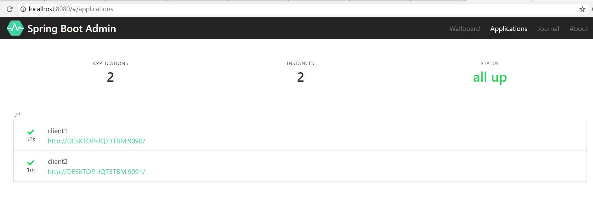

依赖：pom.xml

```xml
    <dependencies>
        <dependency>
            <groupId>de.codecentric</groupId>
            <artifactId>spring-boot-admin-starter-client</artifactId>
            <version>2.0.2</version>
        </dependency>
        <dependency>
            <groupId>org.springframework.boot</groupId>
            <artifactId>spring-boot-starter-security</artifactId>
        </dependency>
        <dependency>
            <groupId>org.springframework.boot</groupId>
            <artifactId>spring-boot-starter-web</artifactId>
        </dependency>
    </dependencies>
```

配置Spring Boot Admin Server的服务器地址

```yml
    #Spring Boot Admin Server的地址
    spring.boot.admin.client.url: "http://localhost:8080"
    #在Spring Boot 2中大多数的endpoints都没有通过暴露web端口，我们需要启用
    management.endpoints.web.exposure.include: "*"
    spring.application.name: client1
```

Spring Security会拦截所有的Endpoint端口

```java
    @Configuration
    public static class SecurityPermitAllConfig extends WebSecurityConfigurerAdapter {
        @Override
        protected void configure(HttpSecurity http) throws Exception {
            http.requestMatcher(EndpointRequest.toAnyEndpoint()).authorizeRequests().anyRequest().permitAll()
                .and().csrf().disable();
        }
    }
```
Spring boot Admin控制台



---

上面是在项目中指定Spring Boot Admin Server的地址，将Client注册到Server的。在Eureka环境中，Spring Boot Admin Server可以从Eureka Server获取到所有Client的信息，我们看下在Eureka环境下如何使用。


Spring Boot Admin Server  依赖配置

```xml
    <parent>
     <groupId>org.springframework.boot</groupId>
     <artifactId>spring-boot-starter-parent</artifactId>
     <version>2.0.3.RELEASE</version>
     <relativePath/> <!-- lookup parent from repository -->
    </parent>

    <dependencies>
     <dependency>
      <groupId>org.springframework.cloud</groupId>
      <artifactId>spring-cloud-starter-netflix-eureka-client</artifactId>
     </dependency>

     <dependency>
      <groupId>de.codecentric</groupId>
      <artifactId>spring-boot-admin-starter-server</artifactId>
      <version>2.0.2</version>
     </dependency>
```

配置文件 application.yml
```yml
    server:
      port: 8080
    spring:
      application:
        name: spring-boot-admin-server
    #配置Eureka客户端
    eureka:
      client:
        serviceUrl:
          defaultZone: ${EUREKA_SERVICE_URL:http://localhost:8761}/eureka/
```

启动类
```java
    @SpringBootApplication
    @EnableAdminServer
    @EnableDiscoveryClient
    public class SpringBootAdminServerApplication {
        public static void main(String[] args) {
            SpringApplication.run(SpringBootAdminServerApplication.class, args);
        }
    }
```

那么Eureka环境下Spring Boot Admin Client又要如何配置呢，我们看下

添加依赖，pom.xml
```xml
        <dependency>
            <groupId>de.codecentric</groupId>
            <artifactId>spring-boot-admin-starter-client</artifactId>
            <version>2.0.2</version>
        </dependency>
        <dependency>
            <groupId>org.springframework.boot</groupId>
            <artifactId>spring-boot-starter-security</artifactId>
        </dependency>
        <dependency>
            <groupId>org.springframework.cloud</groupId>
            <artifactId>spring-cloud-starter-netflix-eureka-client</artifactId>
        </dependency>
```

改配置application.xml
```yml
    server.port: 9090
    spring.application.name: spring-boot-admin-client
    #配置Eureka客户端
    eureka:
      client:
        serviceUrl:
          defaultZone: ${EUREKA_SERVICE_URL:http://localhost:8761}/eureka/
    #暴露endpoint的web端口
    management:
      endpoints:
        web:
          exposure:
            include: "*"
            endpoint:
              health:
                show-details: ALWAYS

```

启动类
```java
    @SpringBootApplication
    @EnableDiscoveryClient
    public class SpringBootAdminClientApplication {
    
        public static void main(String[] args) {
            SpringApplication.run(SpringBootAdminClientApplication.class, args);
        }
    
        @Configuration
        public class SecurityPermitAllConfig extends WebSecurityConfigurerAdapter {
            @Override
            protected void configure(HttpSecurity http) throws Exception {
                http.authorizeRequests().anyRequest().permitAll()
                        .and().csrf().disable();
            }
        }
    }
```