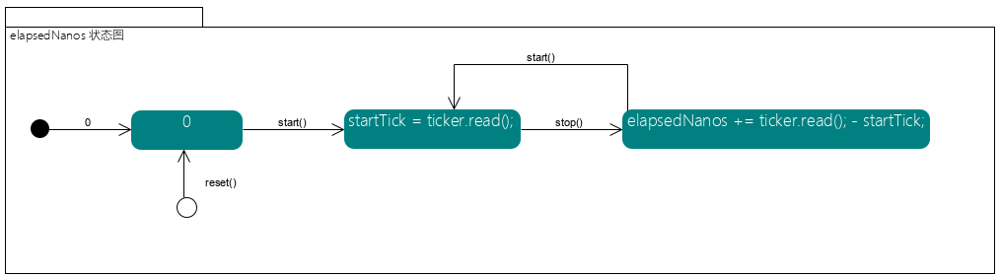

如何创建一个令牌桶

```java
RateLimiter limiter = RateLimiter.create(10);
```

我们看一下RateLimiter.create最终创建的是哪个对象，我们跟一下源码

```java
public static RateLimiter create(double permitsPerSecond) {
    return create(SleepingStopwatch.createFromSystemTimer(), permitsPerSecond);
}

static RateLimiter create(SleepingStopwatch stopwatch, double permitsPerSecond) {
    RateLimiter rateLimiter = new SmoothBursty(stopwatch, 1.0 /* maxBurstSeconds */);
    rateLimiter.setRate(permitsPerSecond); // @a
    return rateLimiter;
}

SmoothBursty(SleepingStopwatch stopwatch, double maxBurstSeconds) {
    super(stopwatch);
    this.maxBurstSeconds = maxBurstSeconds;
}
```

我们可以发现最终创建的是`SmoothBursty`（平滑突发限流、可以透支一次令牌） ，它的目的是为了解决突发流量问题,这里有个方法 `@a setRate`我们看下它做了什么.

``` java
public final void setRate(double permitsPerSecond) {
    checkArgument(
        permitsPerSecond > 0.0 && !Double.isNaN(permitsPerSecond), "rate must be positive");
    synchronized (mutex()) {
        doSetRate(permitsPerSecond, stopwatch.readMicros());
    }
}

void doSetRate(double permitsPerSecond, double stableIntervalMicros) {
    double oldMaxPermits = this.maxPermits; // this.maxPermits 默认为0
    maxPermits = maxBurstSeconds * permitsPerSecond; // maxBurstSeconds 最大可以储存多少秒的令牌，用于缓解突发性流量
    if (oldMaxPermits == Double.POSITIVE_INFINITY) { // Double.POSITIVE_INFINITY = 1.0 / 0.0
        // if we don't special-case this, we would get storedPermits == NaN, below
        storedPermits = maxPermits; // 初始令牌为最大可存储令牌数
    } else {
        storedPermits = (oldMaxPermits == 0.0) ? 0.0 // initial state 
        : storedPermits * maxPermits / oldMaxPermits;
    }
}

```


```java
private Object mutex() {
    Object mutex = mutexDoNotUseDirectly; // mutexDoNotUseDirectly ： 互斥锁
    if (mutex == null) {
        synchronized (this) {
        mutex = mutexDoNotUseDirectly;
        if (mutex == null) {
            mutexDoNotUseDirectly = mutex = new Object();
        }
        }
    }
    return mutex;
}
```


```java
static final SleepingStopwatch createFromSystemTimer() {
    return new SleepingStopwatch() {
        final Stopwatch stopwatch = Stopwatch.createStarted();

        @Override
        long readMicros() {
            // 获取消逝的微秒数
            return stopwatch.elapsed(MICROSECONDS);
        }

        @Override
        void sleepMicrosUninterruptibly(long micros) {
            // 休眠micros微秒
            if (micros > 0) {
            Uninterruptibles.sleepUninterruptibly(micros, MICROSECONDS);
            }
        }
    };
}
```


public double acquire(int permits)；
获取permits个令牌需要等待的毫秒数，在生成足够的令牌前，当前线程会一直阻塞，并返回休眠的秒数。我们看一下源码
```java
public double acquire(int permits) {
    long microsToWait = reserve(permits); // a
    // 线程休眠
    stopwatch.sleepMicrosUninterruptibly(microsToWait);
    // 返回休眠的秒数
    return 1.0 * microsToWait / SECONDS.toMicros(1L);
}
```
我们看下 @a 处的代码逻辑 `reserve(int permits)`。它储备了`@param permits` 个数的令牌供未来使用,并返回生成足够令牌还需要等待的微秒数。让我们看一下它的调用流程
```java
final long reserve(int permits) {
    checkPermits(permits);
    // 互斥
    synchronized (mutex()) {
        return reserveAndGetWaitLength(permits, stopwatch.readMicros());
    }
}
```

```java
final long reserveAndGetWaitLength(int permits, long nowMicros) {
    // 储存最早有效时间（下次可以发起获取令牌的最早时间）
    long momentAvailable = reserveEarliestAvailable(permits, nowMicros); // @a
    return max(momentAvailable - nowMicros, 0);
}
```

看看`@a` 源码

```java
final long reserveEarliestAvailable(int requiredPermits, long nowMicros) {
    resync(nowMicros); // @a
    long returnValue = nextFreeTicketMicros;
    //目前可以获取的令牌数
    double storedPermitsToSpend = min(requiredPermits, this.storedPermits);
    //还需要获取的令牌数
    double freshPermits = requiredPermits - storedPermitsToSpend;
    long waitMicros = storedPermitsToWaitTime(this.storedPermits, storedPermitsToSpend)// 返回值固定为 0
        + (long) (freshPermits * stableIntervalMicros); // stableIntervalMicros 生成两个令牌需要间隔的毫秒数

    try {
      // 下次可以获取令牌的时间
      this.nextFreeTicketMicros = LongMath.checkedAdd(nextFreeTicketMicros, waitMicros);
    } catch (ArithmeticException e) {
      this.nextFreeTicketMicros = Long.MAX_VALUE;
    }
    // 更新令牌桶
    this.storedPermits -= storedPermitsToSpend;
    return returnValue;
}
```

看看`@a` 源码

```java
void resync(long nowMicros) {
    // if nextFreeTicket is in the past, resync to now
    if (nowMicros > nextFreeTicketMicros) {
      // 储存的令牌数  
      storedPermits = min(maxPermits,
          storedPermits
            + (nowMicros - nextFreeTicketMicros) / coolDownIntervalMicros()/*生成下一个令牌的冷却时间*/);
      // 下一次可以发起获取令牌命令的开始时间
      nextFreeTicketMicros = nowMicros;
    }
  }
}
```


再看一下RateLimit另一个核心方法`tryAcquire`,它的目的是判断在指定的`@param timeout`时间之后是否可以发起获取令牌命令，如可可以，则获取`permits`个令牌

```java
public boolean tryAcquire(int permits, long timeout, TimeUnit unit) {
    long timeoutMicros = max(unit.toMicros(timeout), 0);
    checkPermits(permits);
    long microsToWait;
    synchronized (mutex()) {
      long nowMicros = stopwatch.readMicros();
      if (!canAcquire(nowMicros, timeoutMicros)) { // @a 
        return false;
      } else {
        microsToWait = reserveAndGetWaitLength(permits, nowMicros);
      }
    }
    stopwatch.sleepMicrosUninterruptibly(microsToWait);
    return true;
}
``` 

看下 `@a`处到底做了什么
```java
private boolean canAcquire(long nowMicros, long timeoutMicros) {
    // 返回最早可以开始获取令牌的时间
    return queryEarliestAvailable(nowMicros) - timeoutMicros <= nowMicros;
}

final long queryEarliestAvailable(long nowMicros) {
    return nextFreeTicketMicros;// 下一次开始释放令牌的时间
}
```


Stopwatch 用来测量已经过去了多少纳秒，比System#nanoTime好用

让我们看一下类图：


这里面核心的两个Field就是isRunning和elapsedNanos,我们看一下他们的状态变动图




上面的两张状态图将Stopwatch的start(),stop(),reset()方法都串起来了。再看看剩下的elapedNanos()方法,它的目的就是返回经过一系列start、stop、reset操作后消逝的纳秒数，而elaped(TimeUnit)方法可以指定时间单位返回

下面我们再看看Ticker，它只有一个方法，就是read(), 目的就是要返回某个固定点以来经过的纳秒数。此处我们用到了它的一个匿名实现 SYSTEM_TICKER ，返回系统平台当前纳秒数（System.nanoTime()）